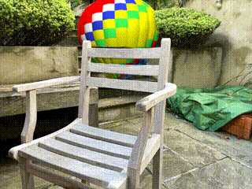

# Virtual Occlusions Through Implicit Depth – CVPR 2023

This is the reference PyTorch implementation for training and testing our implcit depth estimation system:

> **Virtual Occlusions Through Implicit Depth**
>
> [Jamie Watson](https://www.linkedin.com/in/jamie-watson-544825127/), [Mohamed Sayed](https://masayed.com), [Zawar Qureshi](https://qureshizawar.github.io/), [Gabriel J Brostow](http://www0.cs.ucl.ac.uk/staff/g.brostow/),
[Sara Vicente](https://scholar.google.co.uk/citations?user=7wWsNNcAAAAJ&hl=en), [Oisin Mac Aodha](https://homepages.inf.ed.ac.uk/omacaod/) and [Michael Firman](http://www.michaelfirman.co.uk)
>
> [Paper, CVPR 2023 (arXiv pdf w/ supp)](https://arxiv.org/pdf/2305.07014.pdf), [Project Page](https://nianticlabs.github.io/implicit-depth/)

https://user-images.githubusercontent.com/6114258/233341766-a6b465a1-f796-4ca4-a9b4-a497bf75eb1a.mp4

This code is for non-commercial use; please see the [license file](LICENSE) for terms. If you do find any part of this codebase helpful, please cite our paper using the BibTex below and link to this repo. Thanks!

## ⚙️ Setup

Assuming a fresh [Anaconda](https://www.anaconda.com/download/) distribution, you can install dependencies with:

```shell
conda env create -f binarydepth_env.yml
conda activate binarydepth
```

## Data
To download and prepare the ScanNetv2 dataset, please follow the instructions on the [SimpleRecon](https://github.com/nianticlabs/simplerecon) repo.
You will need to update the data configs to point to the location of your 
ScanNetv2 data. You can do this by setting `dataset_path: <YOUR_DATA_LOCATION>` in the six 
`configs/data/scannet_*.yaml` files.

## 📦 Models

We provide the following pretrained models for you to try out - we suggest using the HyperSim trained model to obtain the best qualitative results.

| Model Type                                                                                                                                                                 | Training Data | Temporal Smoothing |
|----------------------------------------------------------------------------------------------------------------------------------------------------------------------------|---------------|--------------------|
| [Implicit Depth (Ours - best qualitative results)](https://storage.googleapis.com/niantic-lon-static/research/implicit-depth/models/implicit_depth_temporal_hypersim.ckpt) | HyperSim      | Yes                |
| [Implicit Depth (Ours)](https://storage.googleapis.com/niantic-lon-static/research/implicit-depth/models/implicit_depth_temporal.ckpt)                                     | ScanNet       | Yes                |
| [Implicit Depth (Ours)](https://storage.googleapis.com/niantic-lon-static/research/implicit-depth/models/implicit_depth.ckpt)                                              | ScanNet       | No                 |
| [Regression](https://storage.googleapis.com/niantic-lon-static/research/implicit-depth/models/regression.ckpt)                                                                                                                                                             | ScanNet       | No                 |

Download these to the `weights/` folder.

## 📊 Evaluation
After downloading the models, you can run our occlusion evaluation as described in the paper with:

```bash
CUDA_VISIBLE_DEVICES=0 python test_bd.py --name implicit_depth \
            --output_base_path outputs \
            --config_file configs/models/implicit_depth.yaml \
            --load_weights_from_checkpoint weights/implicit_depth.ckpt \
            --data_config configs/data/scannet_default_test.yaml \
            --num_workers 8 \
            --batch_size 4;

```
To run depth evaluation add the flag `--binary_eval_depth`.

To instead run our temporal evaluation, use:
```bash
CUDA_VISIBLE_DEVICES=0 python test_bd.py --name implicit_depth \
            --output_base_path outputs \
            --config_file configs/models/implicit_depth.yaml \
            --load_weights_from_checkpoint weights/implicit_depth.ckpt \
            --data_config configs/data/scannet_default_test.yaml \
            --num_workers 8 \
            --batch_size 4 \
            --temporal_evaluation \
            --mv_tuple_file_suffix _eight_view_deepvmvs_dense.txt;

```

We can also evaluate regression models using:
```bash
CUDA_VISIBLE_DEVICES=0 python test_reg.py --name regression \
            --output_base_path outputs \
            --config_file configs/models/regression.yaml \
            --load_weights_from_checkpoint weights/regression.ckpt \
            --data_config configs/data/scannet_default_test.yaml \
            --num_workers 8 \
            --batch_size 4 \
            --regression_plane_eval;

```

## ⚙️ Inference

First, download our example data from [here](https://storage.googleapis.com/niantic-lon-static/research/implicit-depth/example_data.zip), and extract in the current folder. This should create an `example_data` folder here.

Then run the following steps to prepare the dataset.

```bash
# Create a config and txt file specifically for this single sequence
python -m inference.make_config_and_txt_file \
    --input-sequence-dir example_data/scans/garden_chair \
    --save-dir example_data/scans/config

# Find keyframes (test tuples) for this sequence, and save to disk
python ./data_scripts/generate_test_tuples.py \
    --data_config example_data/scans/config/config.yaml \
    --num_workers 16
```

Next we can run inference on each frame in the sequence with the following.

Our implicit depth model requires a depth map as input for each frame, for example as rendered from an AR asset in the scene.
These are loaded from the folder at `--rendered_depth_map_load_dir`.
The `--rendered_depth_map_load_dir` flag is optional; if it isn't specified, then a fixed plane at 2m from the camera is used as the depth input for each inference frame.
You should also download our hypersim model from [here](https://storage.googleapis.com/niantic-lon-static/research/implicit-depth/models/implicit_depth_temporal_hypersim.ckpt).

```bash
CUDA_VISIBLE_DEVICES=0 python -m inference.inference \
    --config configs/models/sr_bd_high_res_sup_pretrained_7525.yaml \
    --load_weights_from_checkpoint weights/implicit_depth_temporal_hypersim.ckpt \
    --data_config example_data/scans/config/config.yaml \
    --rendered_depth_map_load_dir example_data/renders \
    --use_prior \
    --output_base_path example_data/predictions/ \
    --dataset_path example_data/scans
```

## 🖼️ Compositing



To make AR visualisations such as the above video, you need three things:

1) A folder containing:
    1) RGB images of a real scene, and
    2) A json file with camera intrinsics and extrinsics (see example file below for expected format)
2) A folder of RGB and depth renderings of a virtual object for the scene.
    1) These are assumed to be `.png` and `.npy` files respectively, named according to the same convention as the real RGB images.
3) Either:
    1) A folder of compositing masks, e.g. as predicted by our inference code, or
    2) A folder of depth maps, e.g. as predicted by a regression baseline.

You can download our example data [here](https://storage.googleapis.com/niantic-lon-static/research/implicit-depth/example_data.zip).

Here are some example commands to run compositing. These should save `mp4` files into the `--out-dir` folders.

```bash
SEQUENCE_DIR=example_data/scans/garden_chair
RENDERS_DIR=example_data/renders

# Composite with predicted *masks* (e.g. from our implicit depth method)
python -m inference.composite \
    --predicted-masks-dir example_data/reference_predictions/implicit_depth \
    --renders-dir $RENDERS_DIR \
    --vdr-dir $SEQUENCE_DIR \
    --out-dir example_data/composited/implicit_depth

# Composite with predicted *depths* (e.g. from a depth regression baseline)
python -m inference.composite \
    --predicted-depths-dir example_data/reference_predictions/simplerecon_regression \
    --renders-dir $RENDERS_DIR \
    --vdr-dir $SEQUENCE_DIR \
    --out-dir example_data/composited/regression_baseline

# Composite with *lidar* (from apple iphone)
python -m inference.composite \
    --renders-dir $RENDERS_DIR \
    --vdr-dir $SEQUENCE_DIR \
    --out-dir example_data/composited/lidar_baseline
```

The commands above use reference depth and mask predictions given in our example data download.
You can instead use the predictions you made in the 'Inference' step above, by using:

```bash
    --predicted-masks-dir example_data/predictions/implicit_depth/render/garden_chair/ \
```

## ⏳ Training

By default models and tensorboard event files are saved to `~/tmp/tensorboard/<model_name>`.
This can be changed with the `--log_dir` flag.

We train with a batch_size of 12 with 16-bit precision on two A100s on the default ScanNetv2 split.

Example command to train with two GPUs:

```shell
CUDA_VISIBLE_DEVICES=0,1 python train_bd.py --name implicit_depth \
            --log_dir logs \
            --config_file configs/models/implicit_depth.yaml \
            --data_config configs/data/scannet_default_train.yaml \
            --lazy_load_weights_from_checkpoint weights/regression.ckpt \
            --gpus 2 \
            --batch_size 12;
```
Note that we initialise our implicit depth models using a trained regression network, so you will need to download those weights first (see above).

Alternatively, you could train your own regression network from scratch using:
```shell
CUDA_VISIBLE_DEVICES=0,1 python train.py --name regression \
            --log_dir logs \
            --config_file configs/models/regression.yaml \
            --data_config configs/data/scannet_default_train.yaml \
            --gpus 2 \
            --batch_size 16;
```

The code supports any number of GPUs for training.
You can specify which GPUs to use with the `CUDA_VISIBLE_DEVICES` environment.

## 🔧 Other training and testing options

See `options.py` for the range of other training options, such as learning rates and ablation settings, and testing options.

## 🙏 Acknowledgements

Many thanks to Daniyar Turmukhambetov, Jamie Wynn, Clement Godard, and Filippo Aleotti for their valuable help and suggestions.
We'd also like to thank Niantic's infrastructure team for quick actions when we needed them. Thanks folks!

## 📜 BibTeX

If you find our work useful in your research please consider citing our paper:

```bibtex
@inproceedings{watson2023implict,
  title={Virtual Occlusions Through Implicit Depth},
  author={Watson, Jamie and Sayed, Mohamed and Qureshi, Zawar and Brostow, Gabriel J and Vicente, Sara and Mac Aodha, Oisin and Firman, Michael},
  booktitle={Proceedings of the Conference on Computer Vision and Pattern Recognition (CVPR)},
  year={2023},
}
```

## 👩‍⚖️ License

Copyright © Niantic, Inc. 2023. Patent Pending.
All rights reserved.
Please see the [license file](LICENSE) for terms.
